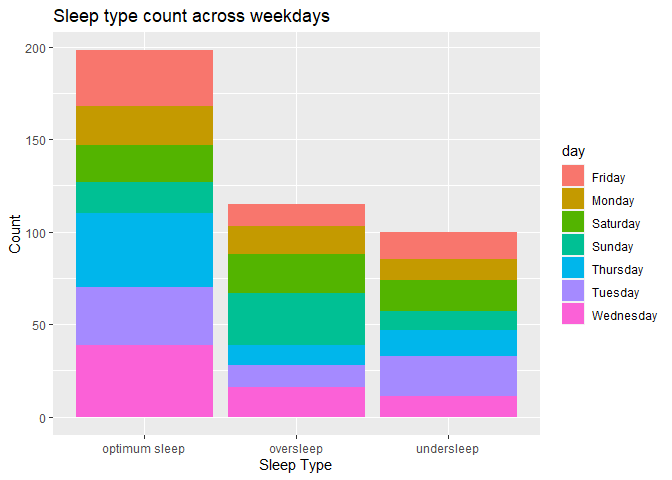

google data analytics capstone project
================
Vivek Joshi
2022-06-30

# Scenario

You are a junior data analyst working on the marketing analyst team at
Bellabeat, a high-tech manufacturer of health-focused products for
women. Bellabeat is a successful small company, but they have the
potential to become a larger player in the global smart device market.
Urška Sršen, cofounder and Chief Creative Officer of Bellabeat, believes
that analyzing smart device fitness data could help unlock new growth
opportunities for the company. You have been asked to focus on one of
Bellabeat’s products and analyze smart device data to gain insight into
how consumers are using their smart devices. The insights you discover
will then help guide marketing strategy for the company. You will
present your analysis to the Bellabeat executive team along with your
high-level recommendations for Bellabeat’s marketing strategy.

For this Analysis Project, I will be following the 6 phases of the Data
Analysis Process namely:

1.Ask 2.Prepare 3.Process 4.Analyze 5.Share 6.Act

## Ask

In this phase we will be using these guiding questions:

1.  What are some trends in smart device usage?
2.  How could these trends apply to Bellabeat customers?
3.  How could these trends help influence Bellabeat marketing strategy?

Key Tasks:

1.  Analyze the available data on smart device usage & come up with a
    solution on how these could be applied to Bellabeat customers to
    help marketing team make profitable decisions.

2.  The key stakeholders involved in this project are :

    -   Urška Sršen: Bellabeat’s cofounder and Chief Creative Officer
    -   Sando Mur: Mathematician and Bellabeat’s cofounder; key member
        of the Bellabeat executive team
    -   Bellabeat marketing analytics team: A team of data analysts
        responsible for collecting, analyzing, and reporting data that
        helps guide Bellabeat’s marketing strategy.

Deliverables:

1.  A clear summary of the business task
2.  A description of all data sources used
3.  Documentation of any cleaning or manipulation of data
4.  A summary of your analysis
5.  Supporting visualizations and key findings
6.  Your top high-level content recommendations based on your analysis

## Prepare

-   Data is stored in the local system in the csv file format.
-   It is organized in a Wide Data Format.
-   It comes from a reliable source(Amazon Mechanical Turk).
-   It is licensed under public domain.
-   To ensure data security, data is available to limited users
-   To ensure data integrity, duplicates were checked and data was
    verified.
-   Some datasets found to be already merged.

### About Data

The data source used for analysis is Kaggle. The dataset used for
analysis was uploaded on Kaggle by
[Möbius](https://www.kaggle.com/arashnic/fitbit). This dataset generated
by respondents to a distributed survey via Amazon Mechanical Turk
between 03.12.2016-05.12.2016. The datasets contained activity data as a
merged file, Steps data, Intensity data, Sleep data, Weight data & heart
rate data of participants. However for this project I will be using
activity data, steps data, calories data & sleep data only.

## Process

I will be using R as a tool for this data analysis project. I am using
this specifically because it processes data more efficiently and a range
of functions available in different R libraries could help me implement
different operations on dataset without losing the original data. One
more advantage of using R is the code is reproducible and if any changes
required, it could be easily implemented. I will check for duplicate
values and missing data to ensure data integrity & transform the data if
required.

Installing the required R libraries.

``` r
library(tidyverse)
```

    ## ── Attaching packages ─────────────────────────────────────── tidyverse 1.3.1 ──

    ## ✔ ggplot2 3.3.6     ✔ purrr   0.3.4
    ## ✔ tibble  3.1.7     ✔ dplyr   1.0.9
    ## ✔ tidyr   1.2.0     ✔ stringr 1.4.0
    ## ✔ readr   2.1.2     ✔ forcats 0.5.1

    ## ── Conflicts ────────────────────────────────────────── tidyverse_conflicts() ──
    ## ✖ dplyr::filter() masks stats::filter()
    ## ✖ dplyr::lag()    masks stats::lag()

``` r
library(readr)
library(here)
```

    ## here() starts at C:/Users/vivek/OneDrive/Documents/My Final Projects Data Analysis/Capstone Project GDA/google-data-analytics-capstone-project

``` r
library(skimr)
library(janitor)
```

    ## 
    ## Attaching package: 'janitor'

    ## The following objects are masked from 'package:stats':
    ## 
    ##     chisq.test, fisher.test

``` r
library(lubridate)
```

    ## 
    ## Attaching package: 'lubridate'

    ## The following objects are masked from 'package:base':
    ## 
    ##     date, intersect, setdiff, union

``` r
library(dplyr)
library(ggplot2)
```

### Importing data

I will import the data that I will be using in this analysis and create
dataframes.

``` r
activity <- read_csv("./data/dailyActivity_merged.csv")
```

    ## Rows: 940 Columns: 15
    ## ── Column specification ────────────────────────────────────────────────────────
    ## Delimiter: ","
    ## chr  (1): ActivityDate
    ## dbl (14): Id, TotalSteps, TotalDistance, TrackerDistance, LoggedActivitiesDi...
    ## 
    ## ℹ Use `spec()` to retrieve the full column specification for this data.
    ## ℹ Specify the column types or set `show_col_types = FALSE` to quiet this message.

``` r
sleep <- read_csv("./data/sleepDay_merged.csv")
```

    ## Rows: 413 Columns: 5
    ## ── Column specification ────────────────────────────────────────────────────────
    ## Delimiter: ","
    ## chr (1): SleepDay
    ## dbl (4): Id, TotalSleepRecords, TotalMinutesAsleep, TotalTimeInBed
    ## 
    ## ℹ Use `spec()` to retrieve the full column specification for this data.
    ## ℹ Specify the column types or set `show_col_types = FALSE` to quiet this message.

Let’s have a look at first few rows of the activity dataset and identify
the column names of activity dataset.

``` r
head(activity)
```

    ## # A tibble: 6 × 15
    ##        Id ActivityDate TotalSteps TotalDistance TrackerDistance LoggedActivitie…
    ##     <dbl> <chr>             <dbl>         <dbl>           <dbl>            <dbl>
    ## 1  1.50e9 4/12/2016         13162          8.5             8.5                 0
    ## 2  1.50e9 4/13/2016         10735          6.97            6.97                0
    ## 3  1.50e9 4/14/2016         10460          6.74            6.74                0
    ## 4  1.50e9 4/15/2016          9762          6.28            6.28                0
    ## 5  1.50e9 4/16/2016         12669          8.16            8.16                0
    ## 6  1.50e9 4/17/2016          9705          6.48            6.48                0
    ## # … with 9 more variables: VeryActiveDistance <dbl>,
    ## #   ModeratelyActiveDistance <dbl>, LightActiveDistance <dbl>,
    ## #   SedentaryActiveDistance <dbl>, VeryActiveMinutes <dbl>,
    ## #   FairlyActiveMinutes <dbl>, LightlyActiveMinutes <dbl>,
    ## #   SedentaryMinutes <dbl>, Calories <dbl>

``` r
colnames(activity)
```

    ##  [1] "Id"                       "ActivityDate"            
    ##  [3] "TotalSteps"               "TotalDistance"           
    ##  [5] "TrackerDistance"          "LoggedActivitiesDistance"
    ##  [7] "VeryActiveDistance"       "ModeratelyActiveDistance"
    ##  [9] "LightActiveDistance"      "SedentaryActiveDistance" 
    ## [11] "VeryActiveMinutes"        "FairlyActiveMinutes"     
    ## [13] "LightlyActiveMinutes"     "SedentaryMinutes"        
    ## [15] "Calories"

Now let’s have a look at first few rows and identify column names of
sleep dataset.

``` r
head(sleep)
```

    ## # A tibble: 6 × 5
    ##           Id SleepDay           TotalSleepRecor… TotalMinutesAsl… TotalTimeInBed
    ##        <dbl> <chr>                         <dbl>            <dbl>          <dbl>
    ## 1 1503960366 4/12/2016 12:00:0…                1              327            346
    ## 2 1503960366 4/13/2016 12:00:0…                2              384            407
    ## 3 1503960366 4/15/2016 12:00:0…                1              412            442
    ## 4 1503960366 4/16/2016 12:00:0…                2              340            367
    ## 5 1503960366 4/17/2016 12:00:0…                1              700            712
    ## 6 1503960366 4/19/2016 12:00:0…                1              304            320

``` r
colnames(sleep)
```

    ## [1] "Id"                 "SleepDay"           "TotalSleepRecords" 
    ## [4] "TotalMinutesAsleep" "TotalTimeInBed"

Let’s look at summary statistics of some columns we will be using for
the analysis

``` r
activity %>% 
  select(TotalSteps, TotalDistance, VeryActiveMinutes,  Calories )%>% summary()
```

    ##    TotalSteps    TotalDistance    VeryActiveMinutes    Calories   
    ##  Min.   :    0   Min.   : 0.000   Min.   :  0.00    Min.   :   0  
    ##  1st Qu.: 3790   1st Qu.: 2.620   1st Qu.:  0.00    1st Qu.:1828  
    ##  Median : 7406   Median : 5.245   Median :  4.00    Median :2134  
    ##  Mean   : 7638   Mean   : 5.490   Mean   : 21.16    Mean   :2304  
    ##  3rd Qu.:10727   3rd Qu.: 7.713   3rd Qu.: 32.00    3rd Qu.:2793  
    ##  Max.   :36019   Max.   :28.030   Max.   :210.00    Max.   :4900

From above summary we can see on an average total steps taken by
participants were 7638 & there are people in dataset for whom there was
not a single step recorded. The average total distance tracked by the
tracker is 5.490 kms.The maximum time spent on intense activity by a
user is 3 hours 30 minutes.

Let’s look at some summary statistics of some columns we will be using
in sleep dataset

``` r
sleep %>% 
  select(TotalMinutesAsleep, TotalTimeInBed) %>%
  summary()
```

    ##  TotalMinutesAsleep TotalTimeInBed 
    ##  Min.   : 58.0      Min.   : 61.0  
    ##  1st Qu.:361.0      1st Qu.:403.0  
    ##  Median :433.0      Median :463.0  
    ##  Mean   :419.5      Mean   :458.6  
    ##  3rd Qu.:490.0      3rd Qu.:526.0  
    ##  Max.   :796.0      Max.   :961.0

From the above summary statistics we can see the 75% of the people that
participated in this dataset slept at least for 6 hours. The average of
total sleep recorded is 7 hours.

Let’s take a glimpse for the datasets to get a summary of different
variables and their types.

``` r
glimpse(activity)
```

    ## Rows: 940
    ## Columns: 15
    ## $ Id                       <dbl> 1503960366, 1503960366, 1503960366, 150396036…
    ## $ ActivityDate             <chr> "4/12/2016", "4/13/2016", "4/14/2016", "4/15/…
    ## $ TotalSteps               <dbl> 13162, 10735, 10460, 9762, 12669, 9705, 13019…
    ## $ TotalDistance            <dbl> 8.50, 6.97, 6.74, 6.28, 8.16, 6.48, 8.59, 9.8…
    ## $ TrackerDistance          <dbl> 8.50, 6.97, 6.74, 6.28, 8.16, 6.48, 8.59, 9.8…
    ## $ LoggedActivitiesDistance <dbl> 0, 0, 0, 0, 0, 0, 0, 0, 0, 0, 0, 0, 0, 0, 0, …
    ## $ VeryActiveDistance       <dbl> 1.88, 1.57, 2.44, 2.14, 2.71, 3.19, 3.25, 3.5…
    ## $ ModeratelyActiveDistance <dbl> 0.55, 0.69, 0.40, 1.26, 0.41, 0.78, 0.64, 1.3…
    ## $ LightActiveDistance      <dbl> 6.06, 4.71, 3.91, 2.83, 5.04, 2.51, 4.71, 5.0…
    ## $ SedentaryActiveDistance  <dbl> 0, 0, 0, 0, 0, 0, 0, 0, 0, 0, 0, 0, 0, 0, 0, …
    ## $ VeryActiveMinutes        <dbl> 25, 21, 30, 29, 36, 38, 42, 50, 28, 19, 66, 4…
    ## $ FairlyActiveMinutes      <dbl> 13, 19, 11, 34, 10, 20, 16, 31, 12, 8, 27, 21…
    ## $ LightlyActiveMinutes     <dbl> 328, 217, 181, 209, 221, 164, 233, 264, 205, …
    ## $ SedentaryMinutes         <dbl> 728, 776, 1218, 726, 773, 539, 1149, 775, 818…
    ## $ Calories                 <dbl> 1985, 1797, 1776, 1745, 1863, 1728, 1921, 203…

``` r
glimpse(sleep)
```

    ## Rows: 413
    ## Columns: 5
    ## $ Id                 <dbl> 1503960366, 1503960366, 1503960366, 1503960366, 150…
    ## $ SleepDay           <chr> "4/12/2016 12:00:00 AM", "4/13/2016 12:00:00 AM", "…
    ## $ TotalSleepRecords  <dbl> 1, 2, 1, 2, 1, 1, 1, 1, 1, 1, 1, 1, 1, 1, 1, 1, 1, …
    ## $ TotalMinutesAsleep <dbl> 327, 384, 412, 340, 700, 304, 360, 325, 361, 430, 2…
    ## $ TotalTimeInBed     <dbl> 346, 407, 442, 367, 712, 320, 377, 364, 384, 449, 3…

Following things can be observed from the glimpse of data above: 1. The
column names are in Pascal case. 2. This is a wide data format 3. The
activity data set contains all the variables that are in steps,
intensity & calories data.So I can use the activity data set for
analysis steps, intensity & calories. 4. The number of observations are
940 in Activity data set but only 413 in Sleep data set. 5. The dates
columns are not in proper format.

First we will make the column names easier to read & review them.

``` r
#Using function from janitor library to clean names.

activity <- clean_names(activity)
sleep <- clean_names(sleep)

#Reviewing first three rows of each dataset.

head(activity, 3)
```

    ## # A tibble: 3 × 15
    ##           id activity_date total_steps total_distance tracker_distance
    ##        <dbl> <chr>               <dbl>          <dbl>            <dbl>
    ## 1 1503960366 4/12/2016           13162           8.5              8.5 
    ## 2 1503960366 4/13/2016           10735           6.97             6.97
    ## 3 1503960366 4/14/2016           10460           6.74             6.74
    ## # … with 10 more variables: logged_activities_distance <dbl>,
    ## #   very_active_distance <dbl>, moderately_active_distance <dbl>,
    ## #   light_active_distance <dbl>, sedentary_active_distance <dbl>,
    ## #   very_active_minutes <dbl>, fairly_active_minutes <dbl>,
    ## #   lightly_active_minutes <dbl>, sedentary_minutes <dbl>, calories <dbl>

``` r
head(sleep,3)
```

    ## # A tibble: 3 × 5
    ##           id sleep_day        total_sleep_rec… total_minutes_a… total_time_in_b…
    ##        <dbl> <chr>                       <dbl>            <dbl>            <dbl>
    ## 1 1503960366 4/12/2016 12:00…                1              327              346
    ## 2 1503960366 4/13/2016 12:00…                2              384              407
    ## 3 1503960366 4/15/2016 12:00…                1              412              442

Let’s check if any of these datasets contain any null values.

``` r
sum(is.na(activity))
```

    ## [1] 0

``` r
sum(is.na(sleep))
```

    ## [1] 0

There are no missing values in any of these data sets.

Let’s Count total number of unique values in each dataset.

``` r
n_distinct(activity$id)
```

    ## [1] 33

``` r
n_distinct(sleep$id)
```

    ## [1] 24

This provides an important information about the datasets I will be
using in this analysis. Sleep dataset contains less participants(24)
compared to activity dataset(33).

### Data transformation

According to our observations, there seems to be some issue with date &
time formatting with incorrect data types so we are going to convert
them into right data type before moving forward.

``` r
#Converting the activity_date column in activity dataset to date type.

activity$activity_date = as.Date(activity$activity_date, "%m/%d/%Y")

#Converting the sleep_day column in sleep dataset to date type.

sleep$sleep_day = as.Date(sleep$sleep_day, "%m/%d/%Y")

#Checking the format to ensure the conversion took place successfully
class(sleep$sleep_day)
```

    ## [1] "Date"

``` r
class(activity$activity_date)
```

    ## [1] "Date"

In the next step I will be merging the two datasets so I can use both
sleep and activity datasets for second analysis into a third dataset
named as sleep_with_activity but I will limit the participants to 24 to
maintain data consistency.

``` r
#Using inner join of dplyr to implement join

sleep_with_activity <- sleep %>%
  inner_join(activity, by = "id")

#Using filter to filter only common dates.

sleep_with_activity <- filter(sleep_with_activity, sleep_day == activity_date) 

#Checking if same distinct values of Id exist in sleep & sleep2 after the merge
n_distinct(sleep$id)
```

    ## [1] 24

``` r
n_distinct(sleep_with_activity$id)
```

    ## [1] 24

``` r
#Dropping Duplicate Column activity_date & renaming date column
sleep_with_activity <- select(sleep_with_activity, -activity_date)  
 

sleep_with_activity <- rename(sleep_with_activity, date = sleep_day)
```

Now I will extract days from date column in the activity dataset & Sleep
dataset as I will be analysing the days along with other data.

``` r
#Extracting days from date columns in respective datasets. 

activity$day <- weekdays(activity$activity_date, abbreviate = FALSE)
sleep$day <- weekdays(sleep$sleep_day, abbreviate = FALSE)
sleep_with_activity$day<- weekdays(sleep_with_activity$date, abbreviate = FALSE)
```

### Visualization & Analysis

Plot to show relationship between total steps taken by people and
calories burned.

``` r
ggplot(data = activity, mapping = aes(x= total_steps, y = calories)) +
  geom_point(color = 'blue') +
  geom_smooth(color='red',formula = y ~ x, method = loess) +
  labs(x="Total Steps", y= "Calories Burned", title="Calories burned vs Total Steps Taken")
```

<!-- -->

Findings : The number of steps affects the overall calories burned.
People used the activity tracker to keep a track on calories burned.

Plotting scatter plot between fairly active minutes& very active minutes
to see correlation with calories

``` r
ggplot(data=activity, mapping = aes(x=fairly_active_minutes, y= calories))+
  geom_point()+
  geom_jitter()+
  geom_smooth(formula = y ~ x, method = loess) +
  labs(title = "Calories burned vs time spent on fairly active intensity",
       x="Fairly Active Minutes", y ="Calories Burned")
```

<!-- -->

``` r
ggplot(data=activity,mapping = aes(x=very_active_minutes, y= calories))+
  geom_point()+
  geom_jitter()+
  geom_smooth(formula = y ~ x, method = loess) +
  labs(title = "Calories burned vs time spent on very active intensity",
       x="Very Active Minutes", y ="Calories Burned")
```

<!-- -->

Findings: It looks like people who involve in high intensive activities
tend to burn more calories.

Let’s now plot charts showing average total steps of all the days
included in the data on a weekly basis & average calories burned.

``` r
#Bar plot showing average calories burned across weeks
ggplot(data= activity)+
  geom_col(mapping = aes(x= day , y= mean(calories))) +
  theme(axis.text.x = element_text(angle = 45)) +
  labs(title = "Average Calories burned across a week ") +
  xlab("Days") + ylab("Average Calories burned")
```

<!-- -->

``` r
#bar plot showing avg steps across a week 
ggplot(data= activity) +
  geom_col(mapping =  aes(x= day, y= mean(total_steps), fill = day)) +
  theme(axis.text.x = element_text(angle = 45)) +
  labs(title = "Average Steps vs Weekdays", subtitle = "Average Steps Across A Week")
```

<!-- -->

Findings: According to the above two bar plots, on an average people
preferred to involve in physical activities mostly during
Mid-week(Tuesday, Wednesday & Thursday) as most calories burned on these
days. On Mondays and Sundays, the number of steps on an average are
comparatively lower than mid-week.

Now I will analyse the steps data but before that I will categorize the
steps into three types based on the assumption: 1. 4000 or less number
of steps as low 2. Number of steps between 4000 & 8000 as medium 3. 8000
& above number of steps as high.

``` r
#Making a new dataframe object "activity2" to save different categories along with id and calories.

activity2 <- activity %>% select(id, calories, total_steps) %>% mutate(
  steps_type = case_when(total_steps <= 4000 ~"Low",
                            total_steps > 4000 & total_steps < 8000 ~"Medium",
                            total_steps >= 8000 ~"High"))
```

Now I am going to Plot a bar chart showing steps type based on count of
steps

``` r
ggplot(data= activity2)+
  geom_bar(mapping = aes(x= steps_type, fill= steps_type), show.legend = FALSE)+
  labs(title ="Total count of steps by steps type", x="Steps Type", y= "count")
```

<!-- -->

According to the
[research](https://www.nih.gov/news-events/nih-research-matters/number-steps-day-more-important-step-intensity)
mentioned in this article: -adults who took 8,000 or more steps a day
had a reduced risk of death over the following decade than those who
only walked 4,000 steps a day.

Also According to
[research](https://www.cdc.gov/media/releases/2020/p0324-daily-step-count.html)
mentioned in this article: -compared with taking 4,000 steps per day, a
number considered to be low for adults, taking 8,000 steps per day was
associated with a 51% lower risk for all-cause mortality (or death from
all causes). Taking 12,000 steps per day was associated with a 65% lower
risk compared with taking 4,000 steps.

Insights:From the above bar chart, almost half of the observations in
the dataset indicate people took less than 8,000 steps on most days.
People lacking consistency or more time spent on sedentary activities
may be a reason behind this.

Here I am done with steps and activity data analysis. I will move to
analyse sleep now.

## Analysis of Sleep Data

Before analysing the sleep data that we will create columns indicating
different sleep types assuming 6 to 8 hours of sleep as optimum sleep,
less than 6 as undersleep and more than 8 as oversleep.

``` r
sleep_with_activity <-sleep_with_activity %>% mutate(sleep_type = case_when(
  (total_minutes_asleep) < 360 ~ "undersleep",
  (total_minutes_asleep) >= 360 & (total_minutes_asleep) <= 480 ~ "optimum sleep",
  (total_minutes_asleep) > 480 ~ "oversleep")
)
```

Now let’s plot a stacked bar graph of different sleep types with days

``` r
ggplot(data = sleep_with_activity)+
  geom_bar(mapping = aes(x= sleep_type, fill = day))+
  labs(title= "Sleep type count across weekdays", x="Sleep Type", y="Count")
```

<!-- -->
Findings From above data we can observe that optimum sleep has low
number of counts on Saturday, Sunday & Monday which indicates that
people whose sleep data was recorded ended up sleeping more on weekends
but what’s surprising here is even on Mondays, the count of recommended
sleep that is 6 to 8 hours is low compared to other days. The undersleep
is more prominent on Tuesday & OverSleep on Sunday.

Now let’s plot a bar chart between sleep type & calories

``` r
ggplot(data = sleep_with_activity) +
  geom_col(mapping = aes(x= sleep_type, y= mean(calories)))+
  labs(title= "Total calories burned by users of different sleep types", x= "Sleep Type", 
       y="Total Calories Burned")
```

<!-- -->

In the above bar plot, it looks like people who slept 6 to 8 hours were
able to burn more calories. This may be because their body is able to
endure more intense activities because of proper rest.

## Top Recomendations based on the analysis.

1.  Bellabeat can make content which targets people who are on a high
    calorific diet & more into sedentary activties due to sitting at
    work for longer duration, in order to spread awareness how daily
    walking can help them burn calories alongside other physical
    activities.

2.  The calorie tracking products could be advertised more during
    mid-week to reach a wider audience.

3.  Bellabeat can create content that is based on better health
    awareness, integrate links in the content for its products page and
    explain how it could help the users not only achieve fitness goals
    but also a better health by tracking their steps.

4.  It can also integrate a feature into the user dashboard that shows
    the time series data(like a line-graph) indicating if the user is
    taking healthy number of steps. (8000 and above) and send a
    notification when number of steps get below the optimum number.

5.  Bellabeat can introduce award badges and a scoreboard. Users will
    earn the badge when they achieve a healthy number of steps and the
    top 5 scorers of month get discount coupons.

6.  Both sleeping less and Sleeping in excess are not good for health.
    Bellabeat can intergate a feature in its fitness tracker which
    reminds the users of days when they are most likely oversleep or
    undersleep.

7.  Bellabeat can make content on how to ensure better sleep by making
    content that highlights how the device can help them reach that
    goal. The fitness tracker can alert user if they are having less
    hours of sleep. They can use plot to inform user how oversleeping &
    undersleeping can affect their calories burning goals.


